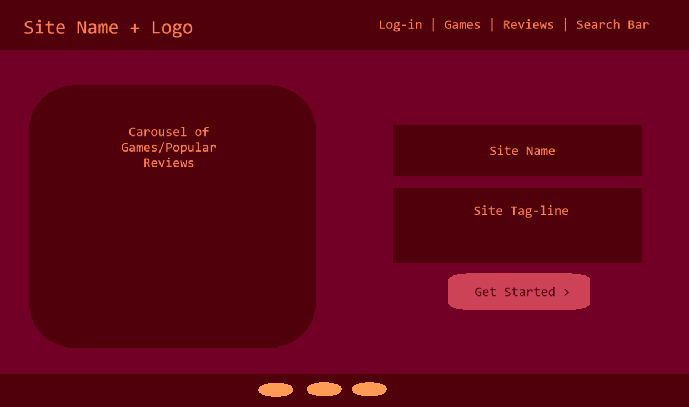

# capstone-project
Capstone Assignment

## Introduction

My submission for my capstone project is PLAYed, a short-form review site that uses Python, HTML, and CSS and various frameworks like Django and Bootstrap.

The live version of this project can be found <a href="https://played-capstone-project-6a17dbaa5b68.herokuapp.com/" target="blank">here.</a>

## CONTENTS
- [User Stories](#USER-STORIES)
- [Design](#DESIGN)
- [Colours](#COLOURS)
- [Fonts](#FONTS)
- [Images](#IMAGES)
- [Wireframes](#WIREFRAMES)
- [Features](#FEATURES)
- [Tech](#TECH)
- [Testing](#TESTING)
- [Improvements](#IMPROVEMENTS)
- [Known Issues](#KNOWN-ISSUES)
- [Sources and References](#SOURCE)

## USER STORIES
The user stories for this project are further explored in the project's <a href="https://github.com/users/AbraWalker/projects/11" target="blank">kanban board.</a>

-As a site user, I want to log in to submit my own reviews and interact with others’ reviews. 
-As the site owner, I want to impose a character limit on every review, so users have to be concise. 
-As a user, I want to be able to find reviews for games I care about. 
-As an administrator, I want users to be able to delete their posts, but not edit them, so posts cannot be manipulated. 
-As a site user, I don’t want to see content that is irrelevant, offensive, etc.. 
-As a site user, I want to track the games I have played. 
-As a site user, I want to upload guides for other users to read. 
-As a site user, I want the site to be easy to view on all devices. 

## DESIGN
Taking these user stories into account, I wanted a site that was stylish and suitable to all ages to access.
It was important that the site did not look affiliated with other gaming companies, review sites or gaming platforms.

### COLOURS
The basic colour scheme I chose for my site is:  
`#4F000B`  
`#720026`  
`#CE4257`  
`#FF7F51`  
`#FF9B54`  
I decided the colours need to be bright, though not too similar to existing game-platform colour schemes. As these platforms tend to use dark blues/greens, I focused on warmer colours.
The palette can be viewed <a href="https://coolors.co/4f000b-720026-ce4257-ff7f51-ff9b54" target="blank">on Coolors</a>.

### FONTS
Due to the subject of the content, I chose fonts that were easy to read, and had a slight computerised theme.
[Electrolize](https://fonts.google.com/specimen/Electrolize) for the logo.
[Nunito Sans](https://fonts.google.com/specimen/Nunito+Sans) for the main body.

### IMAGES
All my images were sourced from Pexels.
Minecraft - Photo by Alexander Kovalev: https://www.pexels.com/photo/flat-screen-computer-monitor-3977908/  
Playstation - Photo by Garrett Morrow: https://www.pexels.com/photo/black-dualshock-4-2885014/  
Mortal Kombat - Photo by cottonbro studio: https://www.pexels.com/photo/couple-love-sitting-evening-4009604/  
Pokemon - Photo by Anton: https://www.pexels.com/photo/turned-on-iphone-displaying-pokemon-go-charizard-application-243698/  
Couple - Photo by cottonbro studio: https://www.pexels.com/photo/couple-hands-love-sitting-4009601/  

## WIREFRAMES

Home Page:  

Review Page:  

Using Microsoft Paint for the wireframes, I laid out the different features I wanted the site to have. The navbar and footer are uniform across all pages of the site, as laid out in base.html.

## FEATURES
### Navigation Bar
Using Bootstrap, the navigation bar is the easiest way to access the pages available on the site. When the user logs in, the 'Register' and 'Log-In' links become hidden, and a custom greeting is displayed across all pages. The nav-bar also has a search bar that I wanted users to be able to use to find games, reviews and guides that they were interested in. So as to not have any empty links, all features that I was not able to add to the project have been removed from navigation. When the screensize is smaller, navigation is condensed so everything is still accessible without any awkward scrolling.
### User Authentication
Using AllAuth, users must register and log-in/out to use the site's review posting feature. The registration does not require any email, and usernames must be unique. If a user doesn't want to make an account, they still have the ability to view anything posted on the site but won't be able to interact with it in any way.
### Write Reviews
Using a form, all users can upload a review of a game of their choice with the following metrics:
- Game Title
- Character-limited Review (limited to 250 characters).
- Overall Rating out of 1-5 stars.
- Value Rating out of 1-5 stars.
- Difficulty Rating out of 1-5 stars.
### Delete Reviews
As mentioned in the user stories, users must have the ability to delete any posts they have made. There is also a check in place to ensure users can only delete their own posts. Admins have the ability to delete any post via the admin panel.
### Rating System
As a way to quantify reviews, I have added three rating systems to each review. These ratings could be used to order the review display. As a future feature, I want to add a vote system similar to Reddit's upvoting or Stack Overflow's forum votes, so users can see which users provide consistently well-received reviews, or which reviews they can trust.

## TECH

Languages: Python, HTML, CSS, Javascript  
Frameworks: Bootstrap 5 and Django  
Version Control: Git and GitHub  
Wireframes: Microsoft Paint  
Site Hosting: Heroku  

Heroku has been configured to host this project without error. Using .gitignore, sensitive information like files related to the .venv/.env, secret keys and the database have not been featured in the source control. For the testing and building of the site, a virtual environment was used.
## TESTING
Any errors flagged by HTML and CSS validation have been resolved. 
I have conducted a few tests on the site, including trying to delete another user's reviews, trying to submit a form without all the necessary information, trying to interact with the CRUD elements without being logged in, etc.. 

## IMPROVEMENTS
There are many features I wanted to add to my site that I was unable to complete. For example, I wanted to add the ability to use the search function in the navigation bar to let users search for certain games, reviews and guides. There is still some guide functionality in my project, however I could not get it to work as intended within the timeframe I had. I have left this code in so I can continue to work on this site in the future. I also had a tracking system mentioned in my user stories that I will add in the future. 
Other features I would like to add in the future include:
- Report option, so users can flag content for admins.
- Colourblind/Dark Modes, so users with various impairments or preferences will feel comfortable using the site.
- Hidden features like hidden JS games, so users can spend more time on the site.

## KNOWN ISSUES
There is a small size issue where the pages have horizontal scroll.

## SOURCES AND REFERENCES
I looked up most issues I had during the project on Stack Overflow, as well as W3Schools and GeeksForGeeks. AI was used for a minor bug fix.
